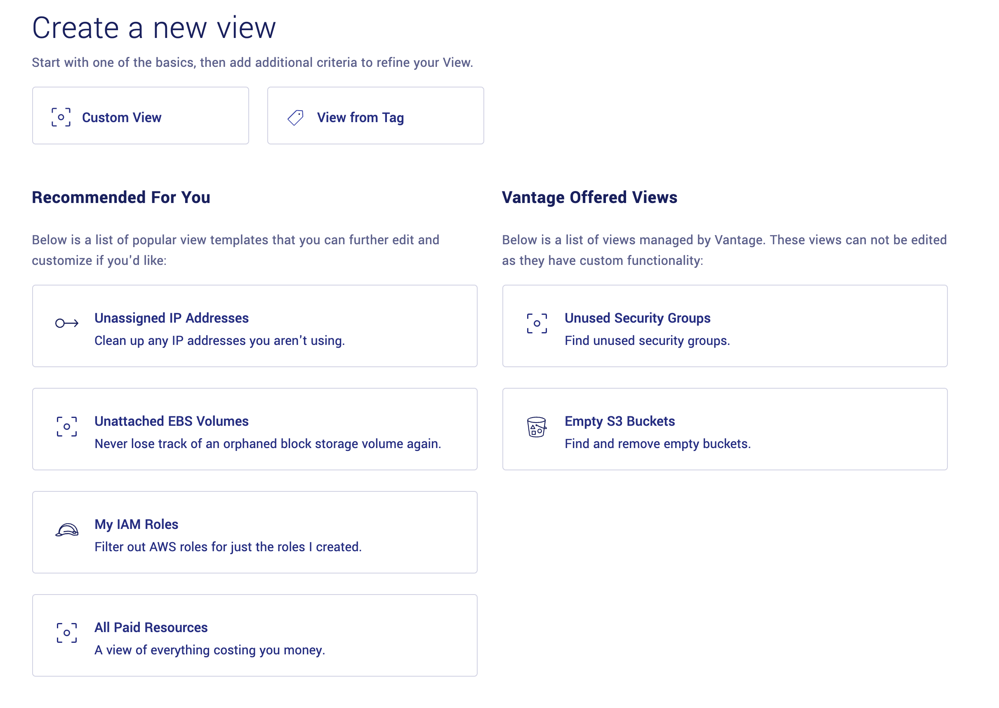

Views are logical groups of AWS resources that help organize your AWS infrastructure across different AWS services, regions and accounts. When you connect your AWS account, Vantage will automatically profile your account and create three sets of views for you:

* **Service Views**: You'll get a view for each service you use (EC2 instances, S3 Buckets, etc.)
* **Tagged Views**: If you use tags on AWS, Vantage will group resources together across different services and regions where it sees "significant" groups of AWS resources.
* **Custom Views**: Vantage will give you your first "custom view" named All Resources that allows you to see all resources in your AWS account. 

You can think of views as being like SQL queries for your infrastructure and you're free to create your own views. 

## View Templates

Every user on Vantage has access to a menu of View templates. Below is a screenshot of the view template menu. 

*Above: Example of View Templates*

View templates are popular views that customers have requested. You're free to select from these view templates to add to your Vantage account or create your own views. 

## Creating Custom Views

Vantage gives you the ability to create your own custom views. When you click "Create View" and then "Custom View" you'll arrive at the [view creation page](https://console.vantage.sh/views/new). 

### Attribute conditions

On this page you'll be able to see all of the AWS services you use and a list of attributes you can optionally choose to filter on. We currently only support a limited support of attributes for each service but if you need additional attributes exposed, please contact support@vantage.sh and there is a possibility we can expose the attribute for you within a few days. 

Currently, conditions have the following operators available:

* **equals**: For finding all AWS resources with an exact match on a certain attribute. For example, show me all EC2 instances where the region is us-east-1.
* **contains**: For finding all AWS resources with a substring match on a certain attribute. For example, show me all EC2 instances where the name contains 'production'.
* **does not contain**: For finding all AWS resources which do not contain a certain string. For example, show me all IAM roles that do not contain 'AWSServiceRoleFor'

### Multiple AWS services in the same view

Vantage supports grouping AWS resources together across multiple services. To do this, simply click the "New Condition Set" and select the additional AWS service you'd like to include. 

## Editting Views

You may edit any view whenever you like. The only exception is you can not edit Vantage-managed views, which have custom logic in place to find resources. To edit a view:

* Click into the view page. 
* Click the "..." in the top right of the page.
* Click "Edit View"
* Make any changes you'd like
* Save the view.

## Deleting Views

You may delete any view whenever you like. To delete a view:

* Click into the view page. 
* Click the "..." in the top right of the page.
* Click "Delete View"

Note that deleting a view on Vantage does not impact any of your AWS infrastructure. It merely removes that view from your Vantage console and no resources are impacted. 

## Recommends Views to Vantage

Vantage is always looking for views to include in our view template menu. If you have a recommendation for a good view for users, we want to hear it. Please recommend it in either our Slack community channel or email support@vantage.sh.